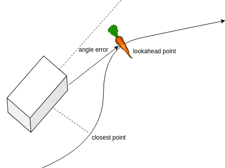
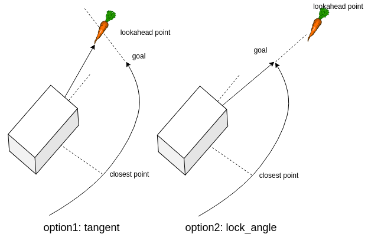

# Carrot local planner

This package implements a local planner that follows paths with a carrot planner approach.

## Control algorithm

### Steering
The carrot planner determines the closes point on the path to the robot. From that point it walks `lookahead_distance` meters forward along the path to determine the lookahead point. The angle between the robot and this point is controlled to zero.

### Forward velocity
Based on the `acc_lim_x` the forward velocity is increased until the maximum velocity is reached.

### Path alignment
When the robot is not aligned towards the direction of the path, we must prevent the robot from driving forwards.
To do this we apply the following algorithm:
    
- If `vel_theta` is approaching `max_vel_theta`, scale down the forward velocity.

This algorithm has been plotted in the figure below.
Effectively this means that the robot will stop moving forward if the angle error is bigger than `max_vel_theta/p`.
This acts like an alighment state.
The robot will move in place until the error is small enough, and then start driving forward.

### Braking at the end of the path
The current braking distance is `s=v^2/2/a`. If the braking distance is approaching the end of the path, a slowdown is initiated.

### Stopping
When the lookahead point reaches the end of the path, the robot switches into the end-of-path mode. There are two options:
1. The robot uses the last two points on the path to determine a line along the curvature of the path. The lookahead point travels along this line.
2. The robot draws a line between the current position and the last point, saves this angle. The lookahead point travels along this line.

